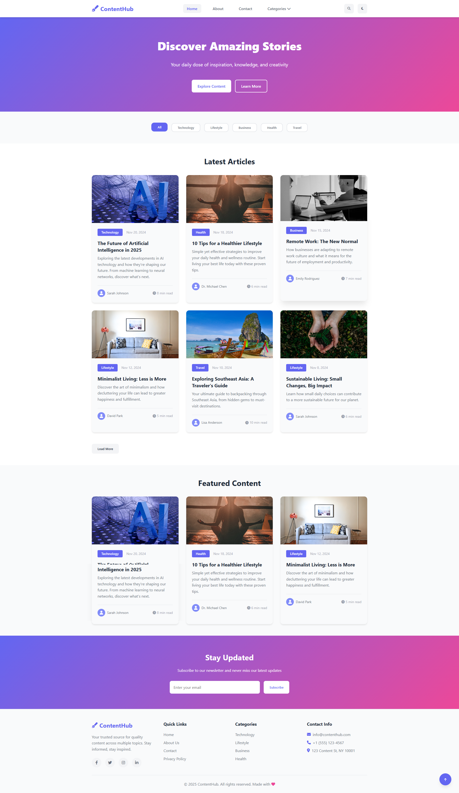
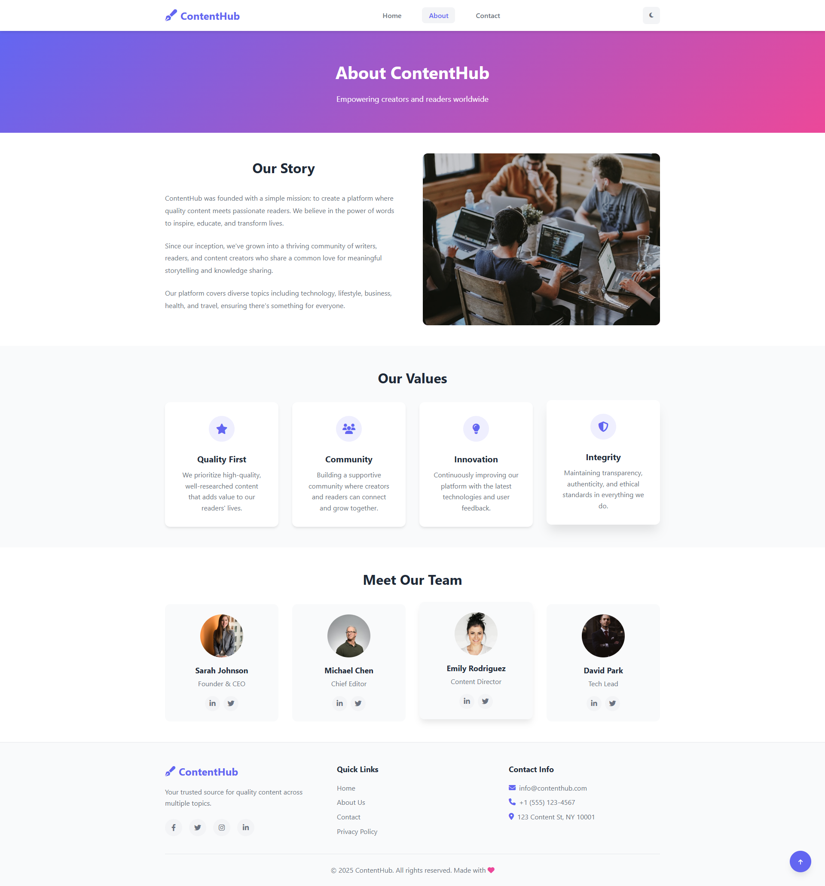
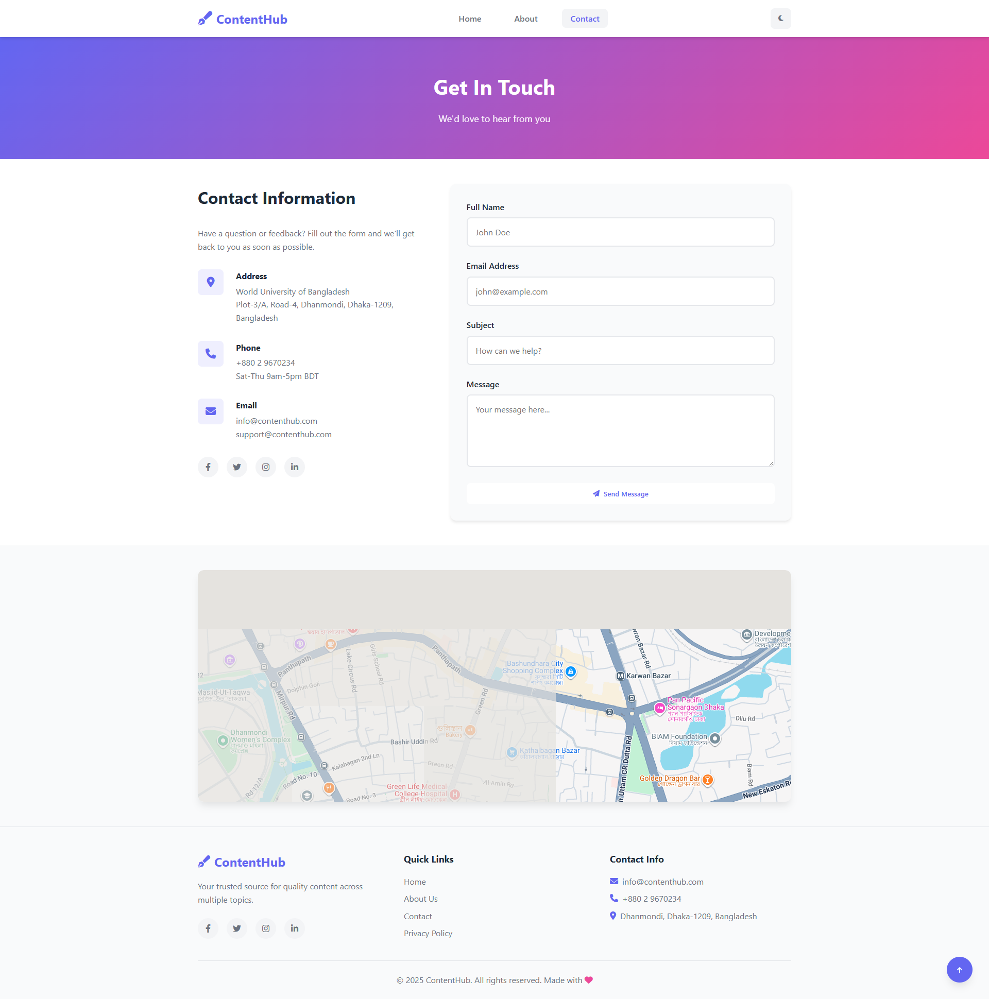

# Modern Content Publishing Platform

A beautiful, responsive, and modern content publishing platform built with HTML, CSS, and JavaScript.

## Screenshots

### Homepage


### Article Page


### About Page


## Features

- 🎨 Modern and clean design
- 📱 Fully responsive layout
- 🌓 Dark/Light theme toggle
- 🔍 Search functionality
- 🏷️ Category filtering
- 📰 Dynamic content loading
- 💌 Newsletter subscription
- 📧 Contact form
- 🔗 Social media integration
- ♿ Accessible and semantic HTML

## Project Structure

```
Modern Content Publishing Platform/
│
├── index.html                 # Main homepage
├── pages/
│   ├── about.html            # About page
│   ├── contact.html          # Contact page
│   └── article.html          # Article detail page
│
├── assets/
│   ├── css/
│   │   └── style.css         # Main stylesheet
│   │
│   └── js/
│       ├── main.js           # Main JavaScript file
│       ├── article.js        # Article page functionality
│       └── data.js           # Sample articles data
│
└── README.md                 # This file
```

## Technologies Used

- **HTML5** - Semantic markup
- **CSS3** - Modern styling with CSS variables, flexbox, and grid
- **JavaScript (ES6+)** - Dynamic functionality and interactions
- **Font Awesome** - Icons

## Getting Started

1. Clone or download this repository
2. Open `index.html` in your web browser
3. Explore the platform!

No build process or dependencies required - it's pure HTML, CSS, and JavaScript!

## Features in Detail

### Homepage
- Hero section with call-to-action buttons
- Category filtering system
- Dynamic article grid
- Featured articles section
- Newsletter subscription
- Responsive navigation

### Article Pages
- Full article view with formatted content
- Related articles section
- Social sharing buttons
- Reading time estimate
- Author information

### Additional Pages
- **About**: Information about the platform and team
- **Contact**: Contact form and information

### User Experience
- Smooth animations and transitions
- Mobile-friendly navigation
- Search overlay
- Scroll-to-top button
- Theme persistence using localStorage

## Customization

### Colors
Edit the CSS variables in `assets/css/style.css`:

```css
:root {
    --primary-color: #6366f1;
    --secondary-color: #ec4899;
    --accent-color: #f59e0b;
    /* ... more colors */
}
```

### Content
Modify the articles in `assets/js/data.js`:

```javascript
const articlesData = [
    {
        id: 1,
        title: "Your Article Title",
        excerpt: "Brief description",
        category: "technology",
        author: "Author Name",
        // ... more properties
    }
];
```

## Browser Support

Works on all modern browsers:
- Chrome
- Firefox
- Safari
- Edge

## Future Enhancements

Potential features to add:
- Comments section
- User authentication
- Backend integration
- Database connectivity
- RSS feed
- Advanced search with filters
- Article bookmarking
- Author profiles

## License

This project is open source and available for educational purposes.

## Credits

- Icons: [Font Awesome](https://fontawesome.com/)
- Design inspiration: Modern web design trends

## Author

Created as a web technology project for educational purposes.

---

**Note**: This is a front-end only project. To add backend functionality, you would need to integrate with a server-side technology (Node.js, PHP, Python, etc.) and a database.
"# ModernContentPublishingPlatform" 
"# Modern-Content-Publishing-Platform" 
